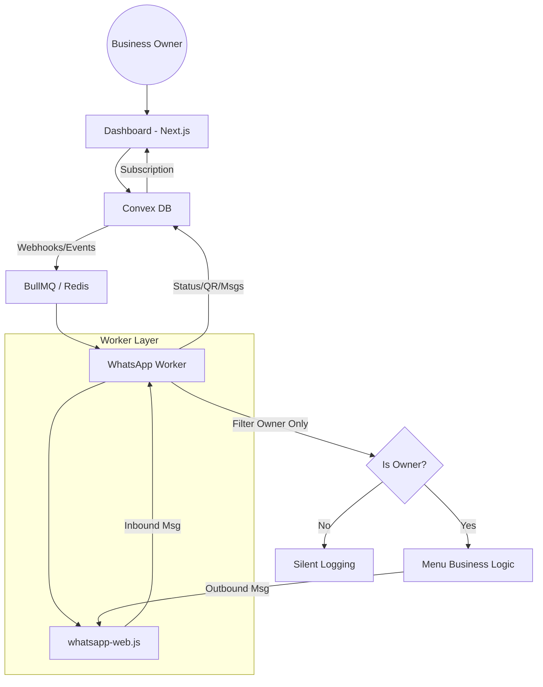

# WhatsApp Automation SaaS Architecture

This document outlines the technical design for a multi-tenant WhatsApp automation platform using `whatsapp-web.js`, Convex, and BullMQ.

## 1. High-Level Architecture

The system is split into three main components:
1.  **Management Dashboard (Next.js + Convex)**: The UI for owners to view QR codes, manage settings, and see message logs.
2.  **WhatsApp Worker (Node.js + whatsapp-web.js)**: A cluster of worker nodes that run the headless Puppeteer browsers.
3.  **Job Queue (Redis + BullMQ)**: Orchestrates message processing and session initialization to ensure reliability.



## 2. Component Breakdown

### A. Convex DB (Data Layer)
Convex serves as our real-time state machine.
- **`sessions` table**:
    - `ownerId`: Reference to the business owner.
    - `phoneNumber`: The owner's WhatsApp number.
    - `status`: `BOOTING`, `WAIT_QR`, `CONNECTED`, `DISCONNECTED`.
    - `qrCode`: The current QR string (for real-time UI rendering).
    - `menuState`: Current step in the owner's chatbot flow (e.g., `MAIN_MENU`, `SETTINGS`, `BROADCAST_SETUP`).
- **`messages` table**:
    - Audit log of incoming/outgoing messages.

### B. BullMQ (Queue Layer)
Ensures the system can scale and recover from worker crashes.
- **`SessionQueue`**: Handles client initialization and authentication.
- **`MessageQueue`**: Processes inbound messages to prevent blocking the Puppeteer event loop.
- **`OutboundQueue`**: Buffers outbound messages to implement rate-limiting and human-like delays.

### C. WhatsApp Worker (Execution Layer)
Each worker process manages multiple `whatsapp-web.js` clients.
- **Session Persistence**: Uses `RemoteAuth` with a strategy that pushes session bundles to a cloud store (e.g., S3 or a dedicated Convex file store) to survive worker restarts.
- **Multi-Tenancy**: Instances are keyed by `clientId` (the `ownerId`).

## 3. Critical Logic: "Owner-Only" Menu

The requirement states that only the owner's number receives menu interactions. Customers are ignored (or logged silently).

### Data Flow for Inbound Message:
1.  Worker receives `message` event.
2.  **Identity Check**:
    ```javascript
    const ownerNumber = await getOwnerNumber(clientId);
    const isOwner = msg.from === ownerNumber;
    ```
3.  **Conditional Routing**:
    - **Owner Message**: 
        - Query `menuState` from Convex.
        - Execute logic related to the state (e.g., "Press 1 to start broadcast").
        - Update `menuState` and send the next menu via `OutboundQueue`.
    - **Customer Message**:
        - Log to `messages` table for the owner to see in the dashboard.
        - **HARD STOP**: No response is sent.

## 4. Session Persistence & Security

- **RemoteAuth Strategy**: When `RemoteAuth` emits the `remote_session_saved` event, the worker uploads the session bundle to a secure store.
- **Worker Recovery**: On startup, the worker checks for active sessions in Convex and re-initializes clients. `RemoteAuth` pulls the bundle and Puppeteer resumes.

## 5. Scaling Strategy

- **Browser Clustering**: Use a library like `puppeteer-cluster` or custom Kubernetes pods to manage resource-heavy browser instances.
- **Sticky Sessions**: (Optional) Use Redis to ensure the same worker handles a specific session for better local cache utilization, though `RemoteAuth` makes this less critical.
